# :raised_hands: your git skills

Ben Limmer  
@blimmer

August 28, 2017
---
## Plumbing vs. Porcelain

We'll stick mostly to using porcelain commands, but reading the [plumbing docs](https://git-scm.com/book/en/v2/Git-Internals-Plumbing-and-Porcelain) is highly recommended once you're familiar with these concepts.
---
## Desired Takeaways

- understand the three github merge options
- feel confident with day-to-day git process
- learn a trick or two

---

### The Three Github PR Options

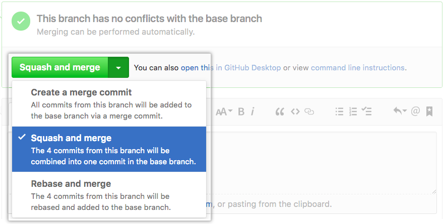

##### source: [github help docs](https://help.github.com/assets/images/help/pull_requests/select-squash-and-merge-from-drop-down-menu.png)

***

# A Tale of Two Histories

---

## Two main schools of thought on commit history

---

## School 0:
### "It's a record of what actually happened"

>It’s a historical document, valuable in its own right, and shouldn’t be tampered with. From this angle, changing the commit history is almost blasphemous; you’re lying about what actually transpired. So what if there was a messy series of merge commits? That’s how it happened, and the repository should preserve that for posterity.

##### source: [git book](https://git-scm.com/book/en/v2/Git-Branching-Rebasing)
---
# Who could forget such classics as...
---

---

---

---
# or my personal favorite...
---

---
Some of these are, of course, shown in jest and the commit messages could be improved.

<p class='fragment'>
This really <strong>is</strong> a record of exactly what happened.
</p>

<p class='fragment'>
However, the historical record can be difficult to traverse.
</p>
---
## School 1:
### "It's the story of how your project was made"

>You wouldn’t publish the first draft of a book, and the manual for how to maintain your software deserves careful editing. This is the camp that uses tools like rebase and filter-branch to tell the story in the way that’s best for future readers.

##### source: [git book](https://git-scm.com/book/en/v2/Git-Branching-Rebasing)
---
# Which gives you commits like these...
---
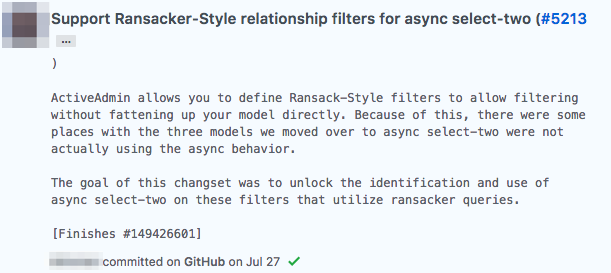
---
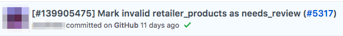
---
# School 0
# vs.
# School 1
---
## School 0
### "It's a record of what actually happened"

### Pros
* Easy
* Low-Risk / Barrier to Entry
* History records what "really happened"

### Cons
* Lots of micro-commits, with varying levels of meaning
* More commits === more time spelunking the logs
---
## School 1
### "It's the story of how your project was made"

### Pros
* Clean, meaningful history
* No "WIP", "Initial", etc. commits

### Cons
* Must be careful with rewriting history
* Can create very "macro" commits containing a lot of code
***
# :see_no_evil:
## on the two schools ?
***
## Merge vs. Rebase
---
## Merge
A merge occurs when you want to integrate two branches together.
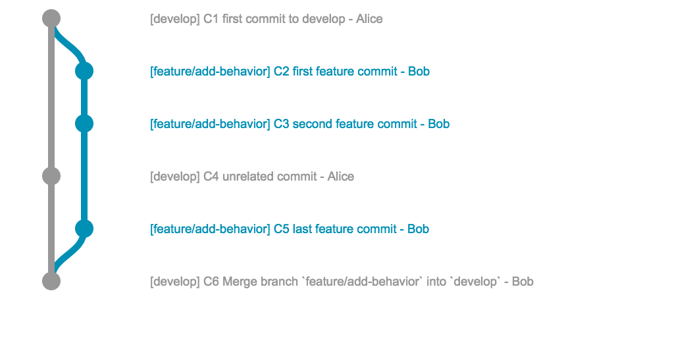
---
When you merge `experiment` into `master`, it performs a three-way merge between
the two latest branch snapshots (C3 and C4) and the most recent common ancestor
of the two (C2), creating a new snapshot (and commit).
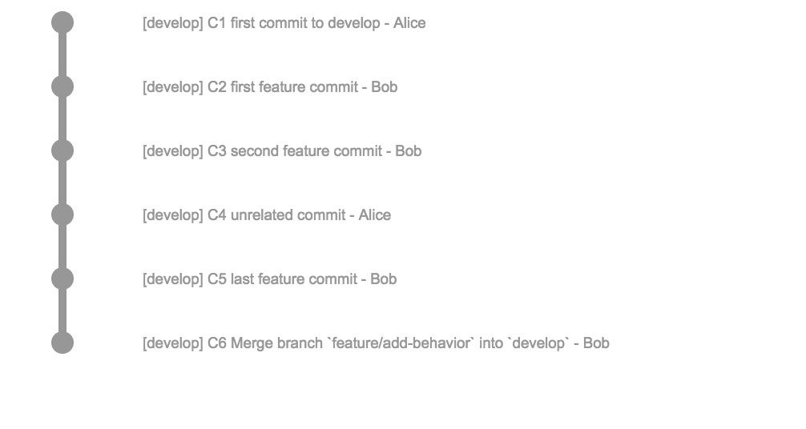
---
This is fine, but we've produced another commit which might not be extremely
valuable.
---
## Rebase
A rebase takes one or more patches and reapplies it on top of new commits on
the destination branch.

---
When you rebase `experiment` off of `master`, it works by going to the common
ancestor of the two branches (C2), generating diffs for each subsequent commit
(C4), and applies the commit to the new commit on `master`.
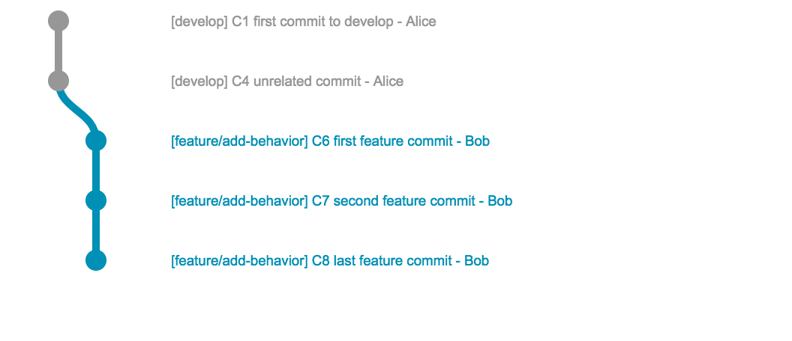
---
Now we can fast-forward merge to `master`, giving us

---
The result of the merge and the rebase are functionally the same, except the
rebase history looks more linear.
---


***
# :flushed:
## on basic rebasing ?
***
But how does this get rid of "meaningless" commits?
<p class='fragment'>
It doesn't directly, but an interactive rebase does.
</p>
---
## Interactive Rebasing
Allows you to "edit" each commit's contents or message as you re-apply each commit
on top of the ancestor branch.
---
While working on a feature branch, you likely have a commit history like this

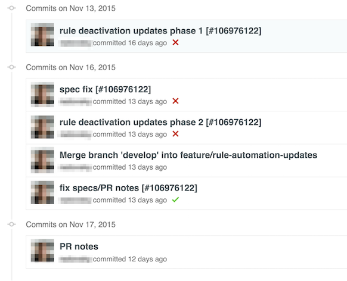
---
However, **very** little actually changed for this feature.


---
Imagine bisecting this and finding that this was the offending commit


---
# :rage:
---
In the example above, there were two problems (IMO):

1. There are a lot of commits retaining history that isn't important to maintain
(e.g. fixing specs and making PR notes)
2. The dev originally branched off of develop, but then merged develop back in.
In total, that means that for this work, there will be two merge commits that
don't mean a lot.
---
How do we fix it?
---
## Interactive Rebase
Before merging the feature into develop, the dev could have done an interactive
rebase in order to "squash" commits.
---
```nohighlight
git checkout develop
git pull origin develop
git checkout feature/x
git rebase -i develop
```
---
This brings you to a screen where you can decide what to do with your commits

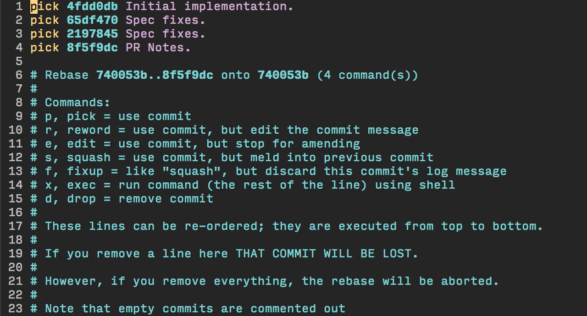
---
## Squash (allthethings)
In this example, I want to squash everything down to 1 commit because that's
the only valuable history on this branch.

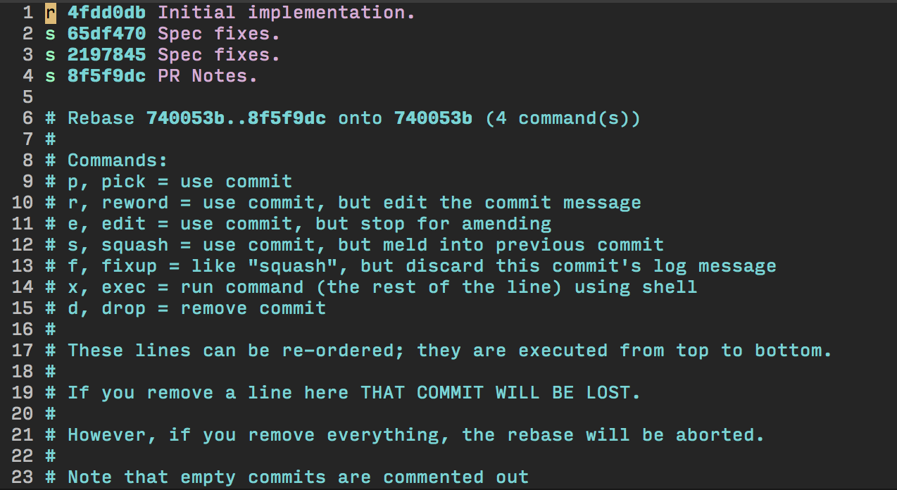
---
## Reword Commit `r`
Since I said I wanted to reword the first commit, I'm brought to this screen

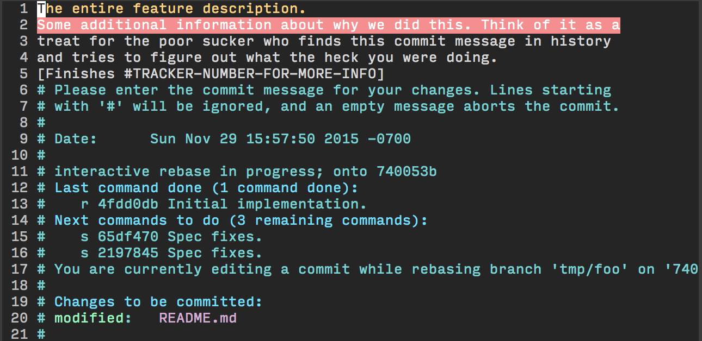
---
## Complete Rebase
Now that I've reworded, I'm shown a final summary of happened

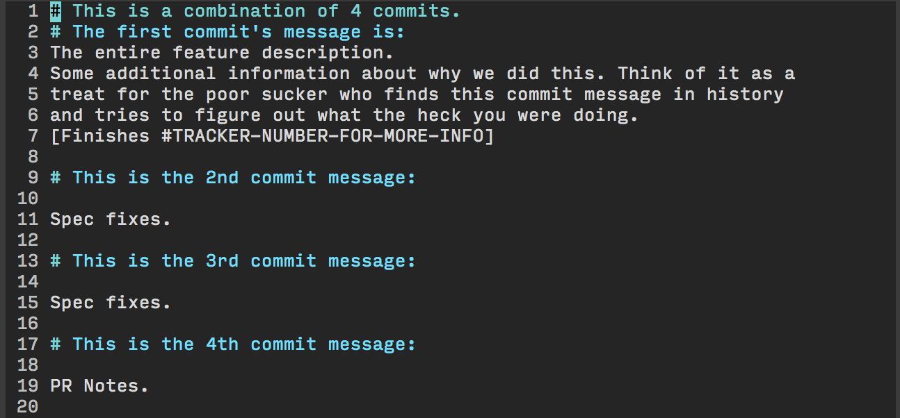
---
## :tada:
We're left with one meaningful commit message!

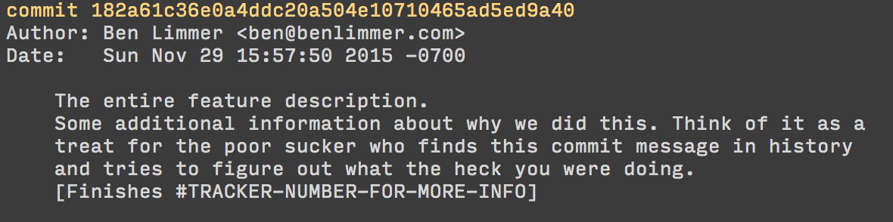
***
# :flushed:
## on interactive rebasing ?
***
# :ambulance:
When re-writing history (e.g. rebasing) can go wrong
---
## Example
Imagine I'm working on a feature branch and it has 3 commits on origin (meaning
I've pushed the branch to GitHub).

Commit Hash | Message | Author
------------|---------|--------
a           | Initial Implementation | blimmer
b           | Test Fixes | blimmer
c           | PR Updates | blimmer
---
I decide to rebase those commits into one commit. However, the designer on my
team has checked out my feature branch, added a commit, and pushed it to origin,
so the history on origin looks like this.

Commit Hash | Message | Author
------------|---------|--------
a           | Initial Implementation | blimmer
b           | Test Fixes | blimmer
c           | PR Updates | blimmer
d           | Fonts & Colors | krsmcd
---
However, if I don't pull from origin first, do an interactive rebase to squash
my three commits into one, and force-push to origin, origin will now have this
history.

Commit Hash | Message | Author
------------|---------|--------
f           | My Squashed Commit | blimmer
---
Doh! I just lost the designer's commit. Let's hope he still has that commit
locally so we can do some git-fu to get it back.

:facepunch:
---
There are two things to take from this accident.

1. If you know others are (or even might be) working on your branch, don't
rewrite history until you're ready to merge.
2. **always** use `--force-with-lease` to ensure your local remote ref is the
same as the origin remote ref (e.g. no one else has pushed commits to your branch)
---
If I would have used

```nohighlight
git push --force-with-lease
```

I would have seen this message

```nohighlight
git push --force-with-lease
To /tmp/repo
[rejected]  feature/x -> feature/x (stale info)
error: failed to push some refs to '/tmp/repo'
```

That would have told me - oh crap, someone else was working on this branch!
---
Ok, it sounds scary but it's really not that bad. 9/10 times I'm working on my
own on a branch. If I'm not, I just wait to do any rebasing until I'm ready to
merge to develop.
***
# :flushed:
## on rebasing safety ?
***
# How we "do Git" on the web team
---
## Git Flow ... kinda

<p class='fragment'>
Kinda, because most of us don't use the git flow plugin.
</p>
<p class='fragment'>
But, from a high level, we have 3-4 kinds of branches.
</p>
---
## master
### a.k.a. the "release branch"
---
## master rules
- **Never** rebased
- Tests always pass
- Tagged with a [GitHub Release](https://help.github.com/articles/creating-releases/) when deploying to prod
- Only branched directly for hotfixes
---
## master benefits
- Allows develop to be in a **semi**-releasable state, with ability to hotfix emergencies
- Tags allow simple history ([changelog generator](https://github.com/skywinder/github-changelog-generator))
---
## develop
### a.k.a. the "next release" branch
---
## develop rules
- **Never** rebased
- Semi-stable
- Tests should pass
- Features/Epics are merged here
---
## develop benefits
- Allows us to build up the next release without dealing with merge conflicts right before deploy
- Easily aggregate changes before a deploy
---
## feature branches
### a.k.a. a "story" branch
---
## feature branch rules
- Rebased at will*
- One testable/deployable piece of work
- PR-ed against develop
---
## feature branch benefits
- Comfortably rebase when you want
- WIP commits OK (will be squashed before merging)
---
## epic branches
### a.k.a. a "collection of story branches" that might take more than a sprint to get deployable
---
## epic branch rules
- Not rebased (until ready for merge to develop)
- Merged into occasionally from develop (if develop is active)
- Related feature branches are branched from the epic branch
- Simply "another develop", but shorter lived
---
## epic branch benefits
- Maintains contract of develop being "semi-stable"
- Avoids huge PR reviews at the end of the epic
- Allow story acceptance as you go (against staging)
---
# Show & Tell
* [releases](https://github.com/Ibotta/Ibotta-Web/releases)
* [changelog](https://github.com/Ibotta/Ibotta-Web/blob/develop/CHANGELOG.md)
* [PRs](https://github.com/Ibotta/Ibotta-Web/pulls)
* [deploy-info](https://ibotta.com/deploy-info) trick
***
# :flushed:
## on how we "do git" ?
***
Let me show you my process.
---
## blimmer's process
1. Branch
2. Work normally
3. Squash
4. Rebase
5. Merge
6. Repeat :beers:
---
## 1. Branch

I always start off the same way - by creating a branch (either from epic or develop).

```nohighlight
git checkout -b feature/my-new-feature
```
---
## blimmer's process
1. ~~Branch~~ √
2. Work normally
3. Squash
4. Rebase
5. Merge
6. Repeat :beers:
---
## 2. Work Normally

WIP commits and all! This branch is yours and you should track work as it makes
sense. Make as many commits as you want, even if they don't have meaning yet.

---
## blimmer's process
1. ~~Branch~~ √
2. ~~Work normally~~ √
3. Squash
4. Rebase
5. Merge
6. Repeat :beers:
---
## 3. Squash

<p class='fragment'>
Squash all meaningless commits. This doesn't mean "every PR must have 1 commit".
</p>

<p class='fragment'>
It simply means that if the diff stored in history by a commit isn't useful on
its own, squash it into some other commit that carries meaning. Remember you can
re-order commits in a rebase!
</p>
---
## blimmer's process
1. ~~Branch~~ √
2. ~~Work normally~~ √
3. ~~Squash~~ √
4. Rebase
5. Merge
6. Repeat :beers:
---
## 4. Rebase

Rebase your branch off of the ancestor branch (usually develop), so only
a fast-forward merge will occur.

---
## blimmer's process
1. ~~Branch~~ √
2. ~~Work normally~~ √
3. ~~Squash~~ √
4. ~~Rebase~~ √
5. Merge
6. Repeat :beers:
---
## 5. Merge
Merge your freshly rebased code into develop or the epic branch.

Via GitHub or the command line.

```nohighlight
git checkout develop
git merge feature/my-new-feature
```

---
## blimmer's process
1. ~~Branch~~ √
2. ~~Work normally~~ √
3. ~~Squash~~ √
4. ~~Rebase~~ √
5. ~~Merge~~ √
6. Repeat :beers:
---
# :tada:
***
# :flushed:
## on the method I use ?
---
# other git tricks
***
## amending the last commit
```nohighlight
git commit --amend
```
---
`git commit --amend`

> It's the little brother of an interactive rebase

#### @onyxraven
---
`git commit --amend`

Takes any staged changes and rolls it into the previous commit. Great for
"PR Notes" commits.

<p class='fragment'>
This <strong>still rewrites history</strong>.
</p>
---
Commit Hash | Message | Author
------------|---------|--------
f           | My Squashed Commit | blimmer
... make some changes ...
---

```nohighlight
git add .
git commit --amend
```

Commit Hash | Message | Author
------------|---------|--------
e           | My Squashed Commit | blimmer

***
***
## adding by patch

```nohighlight
git add -p
```
---

another tool to use instead of

```nohighlight
git add .
```
---

steps through each file patch by patch, staging as you go.

<p class='fragment'>
Imagine a change at the top and bottom of a file, but they're not related to the
same change.
</p>

---

```nohighlight
blimmer:~/code/talks/git (master ✗)
› git add -p
```

---

```nohighlight
› git add -p
diff --git a/README.md b/README.md
index 1a9c834..d25f0d6 100644
--- a/README.md
+++ b/README.md
@@ -1,5 +1,7 @@
 # 1-Up Your Git Skills

+A change at the top
+
 A talk given at the Ibotta Engineering Lunch and Learn series on December 2, 2015.
 This presentation was created with [reveal-ck](https://github.com/jedcn/reveal-ck).

Stage this hunk [y,n,q,a,d,/,j,J,g,e,?]?
```

---

```nohighlight
@@ -16,3 +18,5 @@ If you want to run this project locally:
 3. Run `reveal-ck generate`
 4. Run `reveal-ck serve`
 5. Visit http://localhost:10000
+
+A change at the bottom
```

---

```nohighlight
blimmer:~/code/talks/git (master ✗)
› st
On branch master
Your branch is up-to-date with 'origin/master'.
Changes to be committed:
  (use "git reset HEAD <file>..." to unstage)

	modified:   README.md

Changes not staged for commit:
  (use "git add <file>..." to update what will be committed)
  (use "git checkout -- <file>..." to discard changes in working directory)

	modified:   README.md
```
***
***
# extra credit :100:
<p class='fragment'>
Demo time
</p>
---
ok, that took some time...

<p class='fragment'>
but what history would you rather view if you need to go back through it?
</p>
---
## original
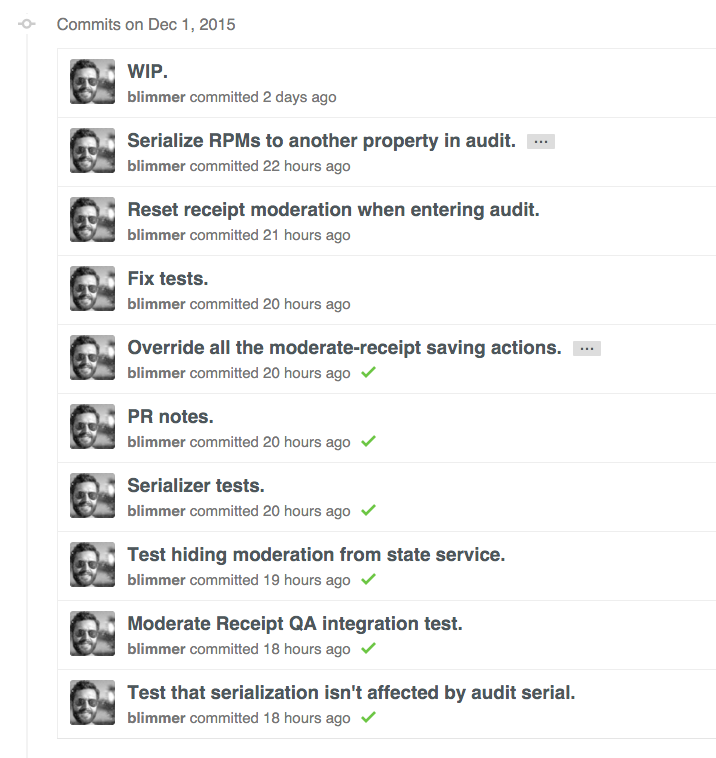
---
### rebase
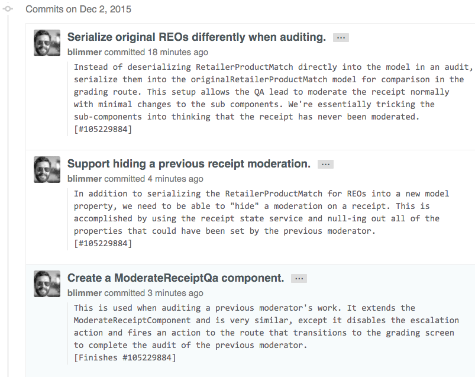
***
# :question:
## on anything else
---
## Resources
- [git book](https://git-scm.com/book/en/v2)
- [rypress git plumbing](http://rypress.com/tutorials/git/plumbing)

```nohighlight
git help <command-name>
```
---
## Thanks!
:bow:

Ben Limmer  
@blimmer  
hello@benlimmer.com  
---
## Legal Stuff
I was heavily influenced by the [Git Book](https://git-scm.com/book/en/v2),
which is licensed under the
[Creative Commons Attribution Non Commercial Share Alike 3.0 license](http://creativecommons.org/licenses/by-nc-sa/3.0/), thus this presentation
is also subject to the same license.

Don't freak out - that just means that you need to attribute it if you use it,
indicate if changes were made and distribute any remix of this work under the
same license.

I reused some of the awesome diagrams and have made minor changes to the
description of how rebases are applied.
