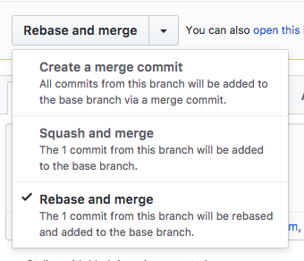
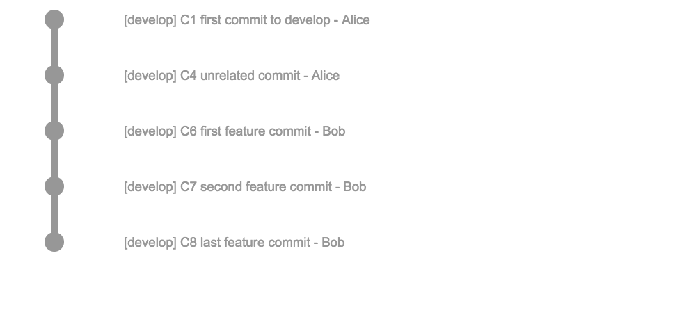
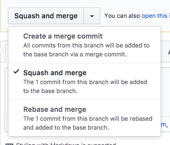
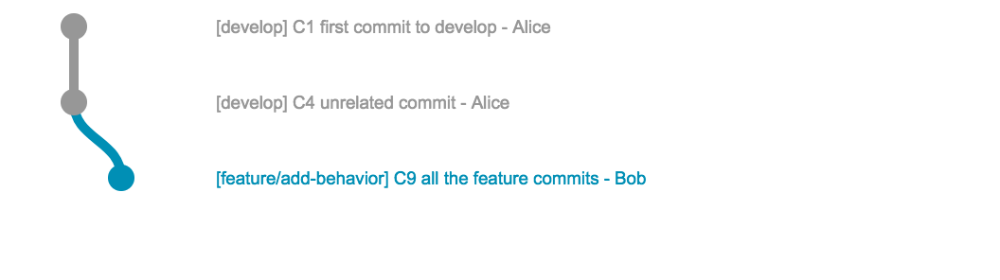
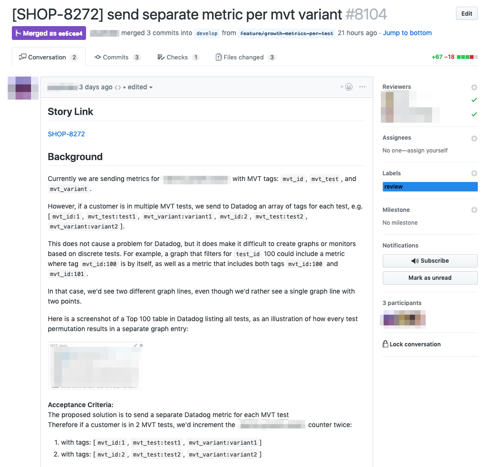
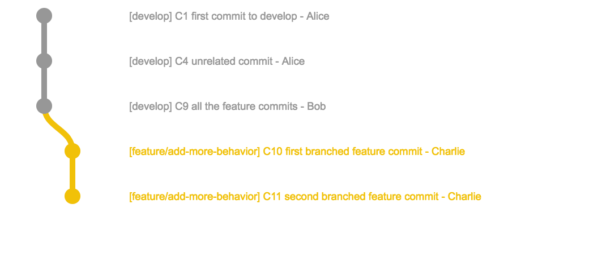

# :raised_hands: your git skills

Ben Limmer  
@blimmer

August 28, 2017
---
## Plumbing vs. Porcelain

We'll stick mostly to using porcelain commands, but reading the [plumbing docs](https://git-scm.com/book/en/v2/Git-Internals-Plumbing-and-Porcelain) is highly recommended once you're familiar with these concepts.
---
## Desired Takeaways

- understand the three github merge options
- feel confident with day-to-day git process
- learn a trick or two

***

### The Three Github PR Options


##### source: [github help docs](https://help.github.com/assets/images/help/pull_requests/select-squash-and-merge-from-drop-down-menu.png)

***
***

## Create a Merge Commit


---
## Merge
A merge occurs when you want to integrate two branches together.

---
When you merge `feature/add-behavior` into `develop`, it performs a three-way merge between the two latest branch snapshots (C4 and C5) and the most recent common ancestor of the two (C1), creating a new snapshot (and commit - C6).

---
This is fine, but we've produced another commit which might not have value.

<p class='fragment'>
Additionally, we have feature branch commits intermixed within the history of <code>develop</code>.
</p>
---

***
# :raising_hand:
## on merging ?
***
## Rebase and Merge


---
A rebase takes one or more commits and reapplies it on top of new commits on the destination branch.

---
When you rebase `feature/add-behavior` off of `develop`, it works by going to the common ancestor of the two branches (C1), generating diffs for each subsequent commit (C2/C3/C5), and replays each commit.

---
Then, the merge can occur as a "fast-forward" merge, creating no merge commit.

---
The result of the merge and the rebase are functionally the same, except the rebase history looks more linear.
---
## Create a Merge Commit

---
## Rebase and Merge

***
# :raising_hand:
## on rebase and merge ?
***

## Squash and Merge


---

A "squash" takes one or more commits, creates a single commit from those commits and applies it to the destination branch.


---
When you squash `feature/add-behavior`, it conceptually rebases the branch as before.


But then, it "squashes" the commits (C6/C7/C8) into one commit.
---
All the commits from the branch are now contained in one commit (C9).

---
Then, the merge can occur as a "fast-forward" merge, creating no merge commit.


<p class='fragment'>
Just like a rebase and merge.
</p>

***
# :raising_hand:
## on squash and merge ?
***
## Create a Merge Commit

---
## Rebase and Merge

---
## Squash and Merge


***
***
# A Tale of Two Histories

---

## Two main schools of thought on commit history

---

## School 0:
### "It's a record of what actually happened"

>It’s a historical document, valuable in its own right, and shouldn’t be tampered with. From this angle, changing the commit history is almost blasphemous; you’re lying about what actually transpired. So what if there was a messy series of merge commits? That’s how it happened, and the repository should preserve that for posterity.

##### source: [git book](https://git-scm.com/book/en/v2/Git-Branching-Rebasing)
---
# Who could forget such classics as...
---

---

---

---
# or my personal favorite...
---

---
Some of these are, of course, shown in jest and the commit messages could be improved.

<p class='fragment'>
This really <strong>is</strong> a record of exactly what happened.
</p>

<p class='fragment'>
However, the historical record can be difficult to traverse.
</p>
---
## School 1:
### "It's the story of how your project was made"

>You wouldn’t publish the first draft of a book, and the manual for how to maintain your software deserves careful editing. This is the camp that uses tools like rebase and filter-branch to tell the story in the way that’s best for future readers.

##### source: [git book](https://git-scm.com/book/en/v2/Git-Branching-Rebasing)
---
# Which gives you commits like these...
---

---

---
# School 0
# vs.
# School 1
---
## School 0
### "It's a record of what actually happened"

### Pros
* Easy
* Low-Risk / Barrier to Entry
* History records what "really happened"

### Cons
* Lots of micro-commits, with varying levels of meaning
* More commits === more time traversing the logs
---
## School 1
### "It's the story of how your project was made"

### Pros
* Clean, meaningful history
* No "WIP", "Initial", etc. commits

### Cons
* Must be careful with rewriting history
* Can create very "macro" commits containing a lot of code

***
# :raising_hand:
## on the two schools ?
***
## Patterns at Ibotta

We enforce "squash and merge" on most repositories.

---

It produces history like this:


---


---



---

A developer that finds this commit years down the road would have lots of context and information on why we changed the code in this way.

***
***

# Gotchas with Squash & Merge

---

Remember our squash and merge from before?


---


---


---

What would happen if someone branched off of our branch before we squashed and merged?

<p class='fragment'>
Their branch would still know about commits C2/C3/C5, but those commits don't exist anymore...
</p>

---

Charlie's branch has commits C2/C3/C5 from when he originally branched from Bob's branch.


---

When Bob merges, he creates C9 and "rewrites history" so that C2/C3/C5 don't end up on develop. But Charlie's branch still knows about Bob's original commits.


---

To fix this, we need to help `git` understand what's going on.

```nohighlight
git rebase --onto develop feature/add-behavior feature/add-more-behavior
```

or replay the last two commits only (ours):

```nohighlight
git rebase --onto develop HEAD~2
```

---

This will result in a nice clean graph:



---

However, when you try to push, git might tell you that you can't...

```nohighlight
> git push origin feature/add-more-behavior
To github.com:blimmer/example-repo.git
 ! [rejected]        add-more-behavior -> add-more-behavior (non-fast-forward)
error: failed to push some refs to 'git@github.com:blimmer/example-repo.git'
hint: Updates were rejected because the tip of your current branch is behind
hint: its remote counterpart. Integrate the remote changes (e.g.
hint: 'git pull ...') before pushing again.
hint: See the 'Note about fast-forwards' in 'git push --help' for details.
```

---

git is warning us that history has changed in a way that it doesn't understand. it's suggesting a `git pull`, but that's not what we want to do (that will re-integrate C2/C3/C5 from origin!)

---

we need to tell git that we know what we're doing and that we just rebased.

```nohighlight
> git push --force-with-lease origin feature/add-more-behavior
```

<p class='fragment'>
<code>origin</code> will now happily accept our newly rebased version of our branch.
</p>
---

:confused:
`--force-with-lease` ???

---

## `--force-with-lease`

Checks to make sure that no-one pushed an additional commit to your branch before you rebased.

---

TLDR; use `--force-with-lease` and if you get a warning that looks like this:

```nohighlight
> git push --force-with-lease origin feature/add-more-behavior
[rejected]  add-more-behavior -> add-more-behavior (stale info)
error: failed to push some refs to 'git@github.com:blimmer/example-repo.git'
```

Check out who else is working on your branch.

***

:raising_hand:
on gotchas?

***

# Other git tricks
- git add by patch
- git bisect
- git revert
- git pull --rebase
- git commit --amend

***
## amending the last commit
```nohighlight
git commit --amend
```
---
`git commit --amend`

> It's the little brother of an interactive rebase

#### @onyxraven
---
`git commit --amend`

Takes any staged changes and rolls it into the previous commit. Great for
"PR Notes" commits.

<p class='fragment'>
This <strong>still rewrites history</strong>.
</p>
---
Commit Hash | Message | Author
------------|---------|--------
f           | My Squashed Commit | blimmer
... make some changes ...
---

```nohighlight
git add .
git commit --amend
```

Commit Hash | Message | Author
------------|---------|--------
e           | My Squashed Commit | blimmer

***
***
## adding by patch

```nohighlight
git add -p
```
---

another tool to use instead of

```nohighlight
git add .
```
---

steps through each file patch by patch, staging as you go.

<p class='fragment'>
Imagine a change at the top and bottom of a file, but they're not related to the
same change.
</p>

---

```nohighlight
blimmer:~/code/talks/git (master ✗)
› git add -p
```

---

```nohighlight
› git add -p
diff --git a/README.md b/README.md
index 1a9c834..d25f0d6 100644
--- a/README.md
+++ b/README.md
@@ -1,5 +1,7 @@
 # 1-Up Your Git Skills

+A change at the top
+
 A talk given at the Ibotta Engineering Lunch and Learn series on December 2, 2015.
 This presentation was created with [reveal-ck](https://github.com/jedcn/reveal-ck).

Stage this hunk [y,n,q,a,d,/,j,J,g,e,?]?
```

---

```nohighlight
@@ -16,3 +18,5 @@ If you want to run this project locally:
 3. Run `reveal-ck generate`
 4. Run `reveal-ck serve`
 5. Visit http://localhost:10000
+
+A change at the bottom
```

---

```nohighlight
blimmer:~/code/talks/git (master ✗)
› st
On branch master
Your branch is up-to-date with 'origin/master'.
Changes to be committed:
  (use "git reset HEAD <file>..." to unstage)

	modified:   README.md

Changes not staged for commit:
  (use "git add <file>..." to update what will be committed)
  (use "git checkout -- <file>..." to discard changes in working directory)

	modified:   README.md
```
***
***
# :question:
## on anything else
---
## Resources
- [git book](https://git-scm.com/book/en/v2)
- [rypress git plumbing](http://rypress.com/tutorials/git/plumbing)

```nohighlight
git help <command-name>
```
---
## Thanks!
:bow:

Ben Limmer  
@blimmer  
hello@benlimmer.com  
---
## Legal Stuff
I was heavily influenced by the [Git Book](https://git-scm.com/book/en/v2),
which is licensed under the
[Creative Commons Attribution Non Commercial Share Alike 3.0 license](http://creativecommons.org/licenses/by-nc-sa/3.0/), thus this presentation
is also subject to the same license.

Don't freak out - that just means that you need to attribute it if you use it,
indicate if changes were made and distribute any remix of this work under the
same license.

I reused some of the awesome diagrams and have made minor changes to the
description of how rebases are applied.
